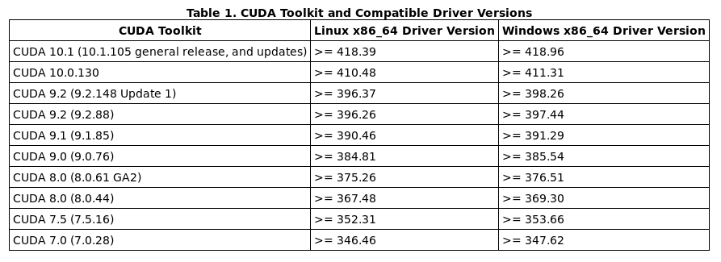
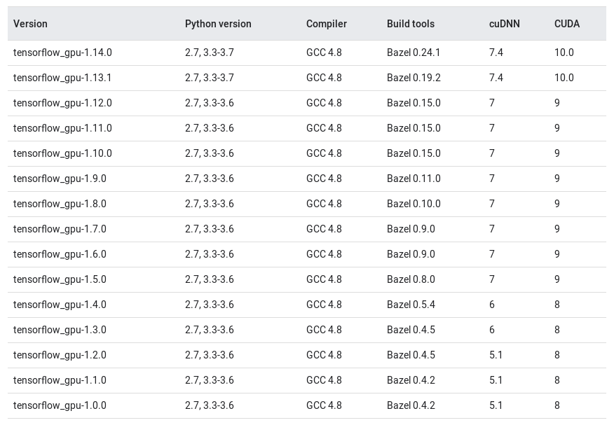

# d2l-numpy

**Dive Into Deep Learning - Numpy**

[http://numpy.d2l.ai/index.html](http://numpy.d2l.ai/index.html)

**Nvidia Driver Download**

[https://www.nvidia.com/Download/index.aspx?lang=en-us](https://www.nvidia.com/Download/index.aspx?lang=en-us)

**Nvidia Driver Cuda Version Match**

[https://docs.nvidia.com/cuda/cuda-toolkit-release-notes/](https://docs.nvidia.com/cuda/cuda-toolkit-release-notes/)

**CUDA Download**

[https://developer.nvidia.com/cuda-toolkit-archive](https://developer.nvidia.com/cuda-toolkit-archive)

**CUDA Install**

[https://docs.nvidia.com/cuda/cuda-installation-guide-linux/index.html](https://docs.nvidia.com/cuda/cuda-installation-guide-linux/index.html)

**cuDNN Download**

[https://developer.nvidia.com/rdp/cudnn-archive](https://developer.nvidia.com/rdp/cudnn-archive)

**cuDNN Install**

[https://docs.nvidia.com/deeplearning/sdk/cudnn-install/](https://docs.nvidia.com/deeplearning/sdk/cudnn-install/)

**tensorflow cuda cudnn version**

[https://www.tensorflow.org/install/source](https://www.tensorflow.org/install/source)
